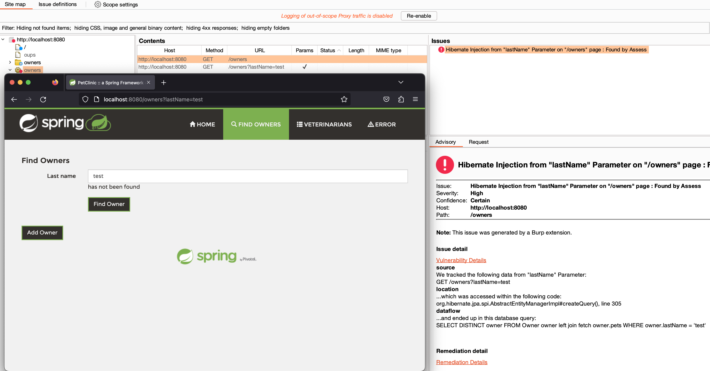

# Burptrast & Contrast Community Edition
Contrast has a free Community Edition of Assess that can be used in conjunction with Burptrast. While this is limited to a Single application and supports only Java, .NET Core or Node applications. It gives you the ability to try out the Assess/Burptrast for free.

## Signup
To setup go to https://www.contrastsecurity.com/contrast-community-edition and sign up at the bottom of the page.

A link will be sent to you to create a password ( This can take several minutes ).

### Configure your application
You will need to add the Agent to the application you wish to instrument. Details of this are available for [Java](https://docs.contrastsecurity.com/en/install-the-java-agent.html) and  [.NET Core](https://docs.contrastsecurity.com/en/install--net-core.html) , you will need to add the Assess agent to the application, start up the application and then jump to the section of this document "Configuring Burptrast"
Or if you wish to trial this with [PetClinic](https://github.com/Contrast-Security-OSS/demo-petclinic) which is an intentionally vulnerable Spring Application we have developed, follow these steps. 

Login to https://ce.contrastsecurity.com . If this is the first login, select configure agent. If you reach the main dashboard click the Plus sign ( + ) at the top right of the page.

Select Java from the dropdown and click "Download the Java contrast_security.yaml"
This file contains the details the agent needs to report results back to TeamServer. It should look like this

**contrast_security.yaml**
```
api:
url: https://ce.contrastsecurity.com/Contrast
api_key: XXXXXXXXX
service_key: XXXXXXXXX
user_name: agent_XXXXXXXXX
```
Download the agent jar file, there are a few ways, but there is a direct link to the contrast.jar file at the bottom of the page. Or you can the contrast.jar from maven https://mvnrepository.com/artifact/com.contrastsecurity/contrast-agent

#### Petclinic

Clone the petclinic application
```
git clone https://github.com/Contrast-Security-OSS/demo-petclinic.git
```
There are several ways to run the application, the petclinic readme gives the details. 
Assuming you have docker installed, the easiest way is to follow the Running in Docker part of the Petclinic readme

Copy the contrast_security.yaml file to the root of the petclinic project e.g
```
cp contrast_security.yaml demo-petclinic/
```
Build the docker image
```
cd demo-petclinic/
./1-Build-Docker-Image.sh
```


#### Run Petclinic

**Please Note, running the application will use up your single Application license .**
If you wish to instrument another application you would need to contact Contrast to get a license, or create another CE addition account.
```
docker run -v $PWD/contrast_security.yaml:/etc/contrast/java/contrast_security.yaml -p 8080:8080 spring-petclinic:1.5.1
```
Once started it should be available on [http://localhost:8080/]()

### Configuring Burptrast

Once you have the instrumented application running, Install Burptrast into Burp, see the README.md for details.
#### Login
Go to the credentials tab


Select Teamserver URL https://ce.contrastsecurity.com/Contrast from the Dropdown
Enter your email and password and press login.
The Status should change from "Awaiting Credentials" to "Ready".
If you don't wish to login each time, you can save the credentials to disk.
This does not store your password, but instead stores the API and Service Key into a file. If you do this it is your responsibility to store this file securely.
Then when you need to connect again, you can select the Credentials file instead of logging in.

#### Use Burptrast
Under the Contrast tab from the Application Drop down select your application in this case "spring-petclinic" from the application name drop down.

Then select Update.
Burptrast will retrieve the list of known vulnerabilities from Teamserver as well as a list of routes, including HTTP Verb type and path parameter into the application.

To start with we can see the list of Routes on the right hand table, these routes will be imported to the Burp Site Map when you select the "Import Routes to Site Map" button. This gives burp the locations of the endpoints within the application, which Burp can then scan.
The Trace table only contains a single vulnerability ( for now ). As the Assess instrumented application is exercised, more vulnerabilities will be found.

Select "Live Browsing". This will add a correlation header to all outbound requests from the Burp Proxy to the application. And as vulnerabilities are found, the correlation id will be used to link it back to this Burp Session and it will show up immediately in the Burp Issues tab.
Select Import Routes to Site Map.
Once done you are ready to access the application via Burp's Proxy.

As you exercise the application via Burp's Proxy, Assess will be running within the target application, as Assess finds vulnerabilities those will appear in the Burp Issues tab, linked to the original HTTP request that triggered that vulnerability.
You can see one ( of a few ) vulnerabilities found by Assess by browsing to http://localhost:8080/owners/find ( in a browser using the burp proxy)

Enter any text you like and press "Find Owner"
No owner will be found. But by searching for an Owner you will exercise the application, Assess's instrumentation will track the request through the application and should find a HQL ( SQLi ) injection vulnerability, if Live Browsing is enabled, should show up in Burp's Issues Tab within about 5 seconds.

The Advisory gives detailed information on the underlying vulnerability, the entry point into the application the data sent to the application and the sink the data ends up in and the SQL Query that was generated. Along with Issue background and links to more information about it that is available on Teamserver.


By clinking on the Vulnerability Details and going to the details tab we can see the entire trace through the application from the web entrypoint to where it hits the database. As well as that the vulnerability is in the OwnerRepositoryCustomImpl.java:22
When we look at the code we can see that on line 22 the lastname parameter is concatenated with the SQL Query leading to the SQL Injection.

Using this information it becomes trivial to write to inject our own query that subverts the logic.

``test' OR 1 = '1``
Which returns all users.

SQL Injection is just one of several dozen rules in Assess, which supports multiple languages and frameworks. Using Assess along with Burp can dramatically improve your Pentest findings where you are able to instrument the underlying application.
