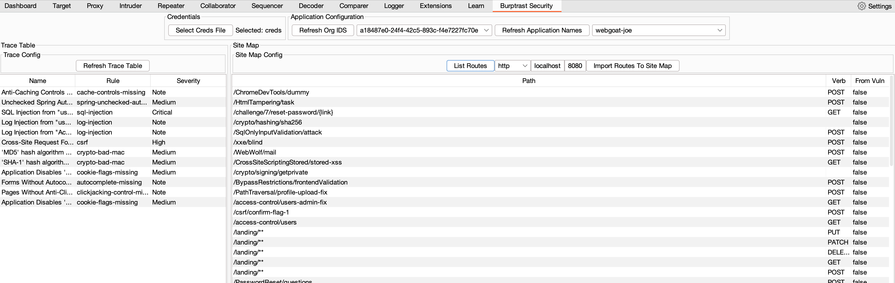

# Burptrast Security

Burptrast is designed to pull endpoint information from Teamserver and import it into Burp's sitemap.
The endpoints come from two sources.
 * Assess Vulnerability information.
 * Endpoints detected by the agent.

The full HTTP Request that generated the Vulnerability is stored in TS and is available via the API. This is imported into Burp. While there is likely to be relatively few of these, they do have the advantage of having the information required to trigger the endpoint. Request/Path Params, Message Body etc.
Endpoints detected by the agent will only have the Path and the HTTP Method ( if you are lucky ). But you are more likely to get all of the endpoints for this application. Hopefully more endpoint information can be gathered by the agent in the future.

## Build
To build run 
```
mvn clean install
```
Import the jar file named Burptrast-1.0-SNAPSHOT-jar-with-dependencies.jar into Burp as an extension.

### Teamserver API Credentials
You will need your TS API Creds in a yaml file. This looks like this
```
api:
  url: https://example.contrastsecurity.com/Contrast
  api_key: aaabbbccc
  service_key: aaabbbcccddd
  user_name: aaabbbccc@ContrastSecurity
```
This is your API credentials. Not what is used by the Agent.
This file is added in the Burptrast UI Tab in Burp.
To get your API Creds, go to the user settings section of TeamServer.




