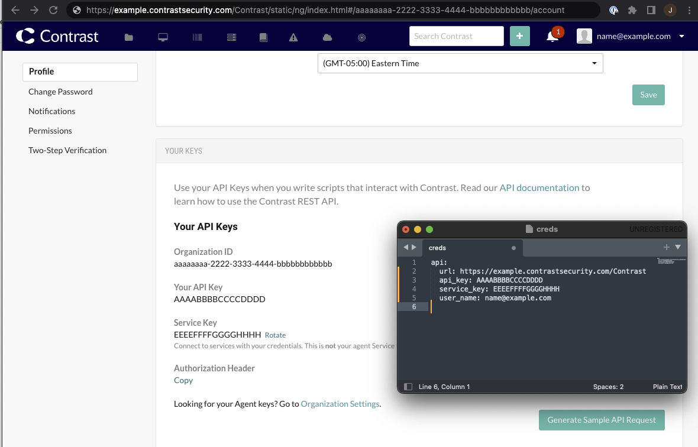
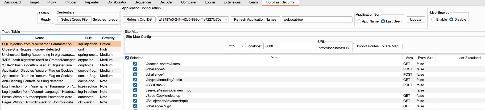

# Burptrast Security

Burptrast is designed to pull endpoint information from Teamserver and import it into Burp's sitemap.
The endpoints come from two sources.
 * Assess Vulnerability information.
 * Endpoints detected by the agent.

The full HTTP Request that generated the Vulnerability is stored in TS and is available via the API. This is imported into Burp. While there is likely to be relatively few of these, they do have the advantage of having the information required to trigger the endpoint. Request/Path Params, Message Body etc.
Endpoints detected by the agent will only have the Path and the HTTP Method ( if you are lucky ). But you are more likely to get all of the endpoints for this application. Hopefully more endpoint information can be gathered by the agent in the future.

## Live Browsing
Live Browsing when enabled, allows you to explore the application via the Burp proxy and get real time feedback from Assess.
It works by adding a Correlation ID Header to every HTTP request, when a vulnerability is found in Assess that is linked to one
of your HTTP requests, it is automatically added to the Burp Issue tab within a few seconds of the request being made, giving near
realtime feedback of your exploration / pentest from Assess directly into your Burp UI.

To use this feature you need to do the following.
 * Select the Application in the Application drop down.
 * Enable Live Browsing
 * Browse the application via the Burp Proxy


## Build
Requires Java 11+

To build run 
```
mvn clean install
```
Import the jar file named Burptrast-1.0-SNAPSHOT-jar-with-dependencies.jar into Burp as an extension.

### Teamserver API Credentials
You will need your TS API Creds in a yaml file. This looks like this
```
api:
  url: https://example.contrastsecurity.com/Contrast
  api_key: aaabbbccc
  service_key: aaabbbcccddd
  user_name: aaabbbccc@ContrastSecurity
```
This is your API credentials. Not what is used by the Agent.
This file is added in the Burptrast UI Tab in Burp.
To get your API Credentials, go to the user settings section of Teamserver as you can see below.



### Corporate Proxies
Burptrast requires access to the Teamserver API to function. If you need to use a Proxy to access Teamserver you can do
so by configuring Burp's Upstream Proxy or SOCKS proxy ( this is different to Burps local proxy listener ) . This is available
under Settings -> Network -> Connections . More details can be found here https://portswigger.net/burp/documentation/desktop/settings/network/connections#upstream-proxy-servers
Once configured connections to Teamserver API by Burptrast will go via this proxy.





